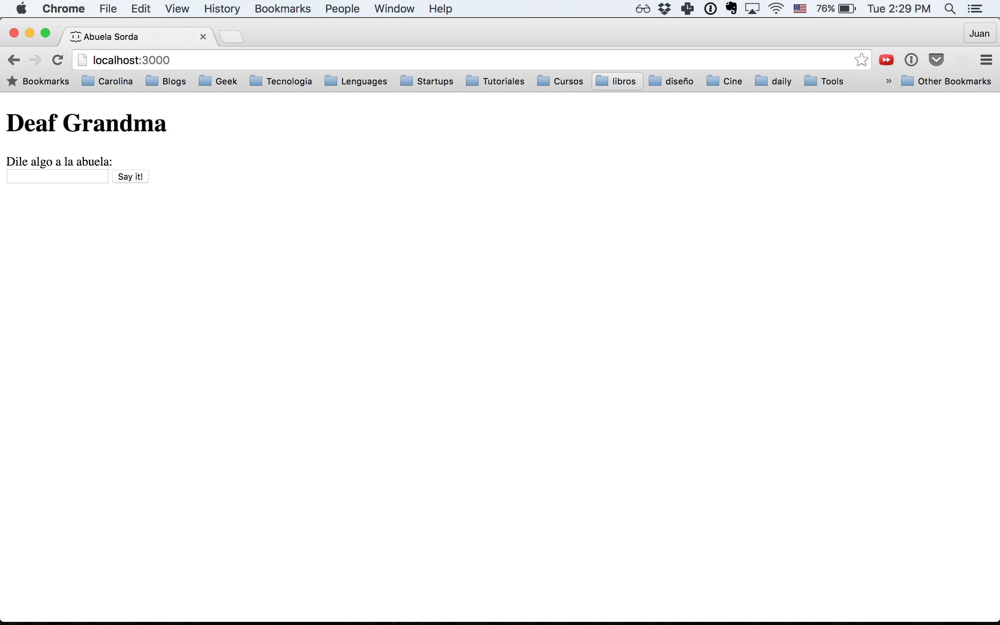

# Deaf Sinatra 1 Synchronous Forms

## Objetivos de Aprendizaje

* Leeer una base de codigo escrita por otro, y ser capaz de contribuir a ella
* Mapear el flujo de datos de una aplicacion
* Usar parametros de la URL para pasar datos al servidor
* Usar formularios para enviar datos al servidor
* Usar flujo de control de JS para cambiar la respuesta del servidor
* Usar redirect y render y saber cuando usar uno o el otro

## Resumen

Vamos a construir nuestra primera sencilla aplicacion web, usando [express](https://expressjs.com/), un framework liviano y sencillo para construir aplicaciones web usando node.

## Pasos

### Paso 0: Corriendo la aplicacion

Este repositorio incluye un esqueleto creado con [express generator](https://expressjs.com/en/starter/generator.html). Explora la estructura de carpetas, te daras cuenta de que la configracion principal del app esta en el archivo app.js, las vistas (archivos de HTML) estan dentro de la carpeta `views` y las rutas de la aplicacion dentro de la carpeta `routes`

Para correr la aplicacion corre el siguiente comando en la terminal parado sobre la carpeta del reto:

```text
$ npm start
```

Luego de eso deberias poder visita la tu applicacion en la url [http://localhost:3000](http://localhost:3000). `localhost` se refiere a la maquina actual en la que estamos, de forma que stas corriendo un pequeño servidor web dentro de tu computador.

It should look like this:

<p style="text-align: center"></p>

Si se ve diferente avisale al profesor para que te ayude.

### Paso 1: Haz que la abuela hable

Primero, visita [http://localhost:3000/?grandma=Oiga!](http://localhost:3000/?grandma=Oiga). Si notas como el valor del paramtro `grandma` de la url se ve en la pagina. Intenta encontrar en el codigo como funciona la logica para que pase esto. Como hacemos para extraer informacion de la URL?

Nota: Cuando pones una direccion en tu navegador, este hace un request HTTP GET. Nota como eso hace match con la ruta definida en `routes/index.js` que dice:

``` javascript
router.get('/', function(req, res, next) { ...
```
Intenta modificar el valor del parametro `grandma` por cualquier otra cosa y miras que pasa. Que pasa si cambias la llave del parametro `grandma` por otra cosa?

El string despues de la URL que se ve asi `?param1=value1&param2=value2` se llama el **query string**, y contiene los parametros del request.

Vuelve a cargar la aplicacion, intenta escribir algo en el formulario y luego dale click en "Dilo!", que pasa ahora y por que ?

### paos 2:  Haz que la abuela tenga logica

Finalmente cambia el archivo `routes/grandma.js` de forma que cuando enviemos un mensaje a la abuela por el formulario haz que este se vea en devuelta en la vista `views/index.ejs`. Basate en la ruta de `routes/index.js` par lograr esto.

Si escribes algo que este todo en mayusculas haz que la abuela responda de forma graciosa. si escribes otra haz que responda 'Hable mas duro!'

Lee la [documentacion de Express](https://expressjs.com/en/guide/routing.html). Para solucionar el reto te daras cuenta de que lo que quieres hacer depues de que se envia el formulario es hacer un `redirect` a `http://localhost:9292/?grandma=foobar` donde `foobar` es lo que quieras que la abuela diga.

## Recursos

* [Express Api](https://expressjs.com/en/4x/api.html)

